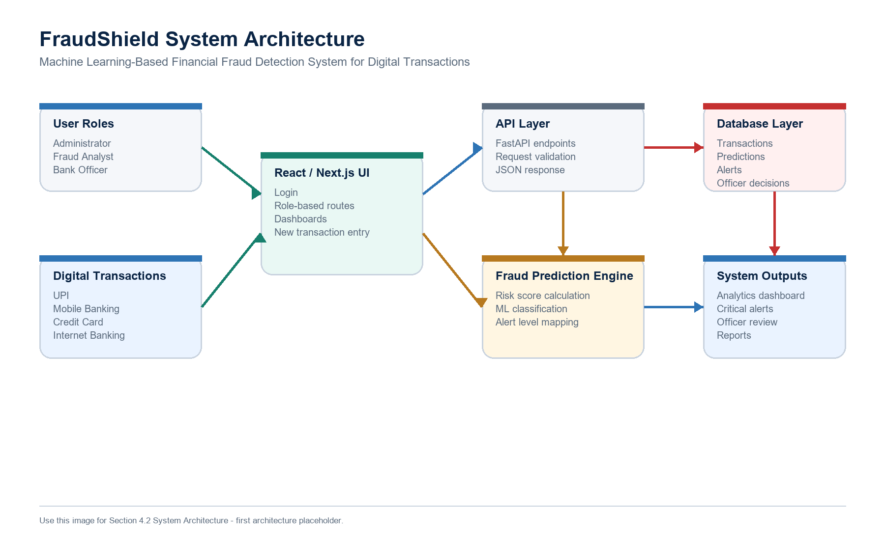
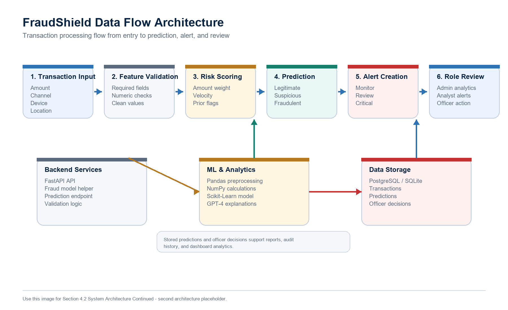
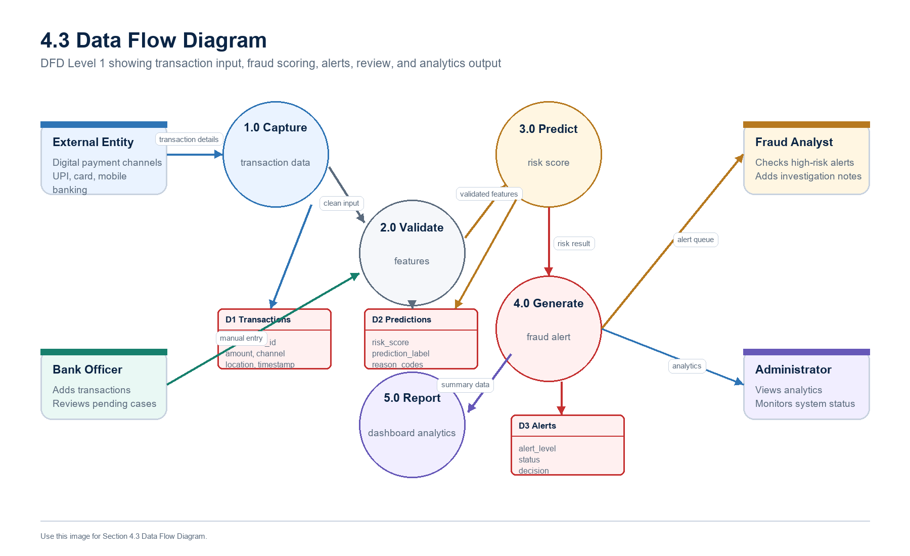
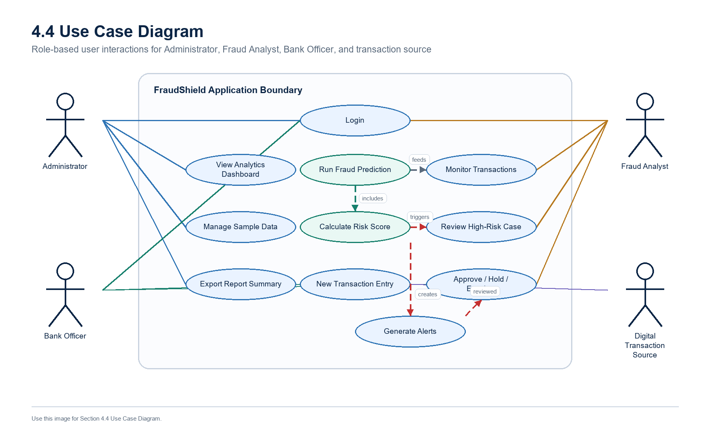
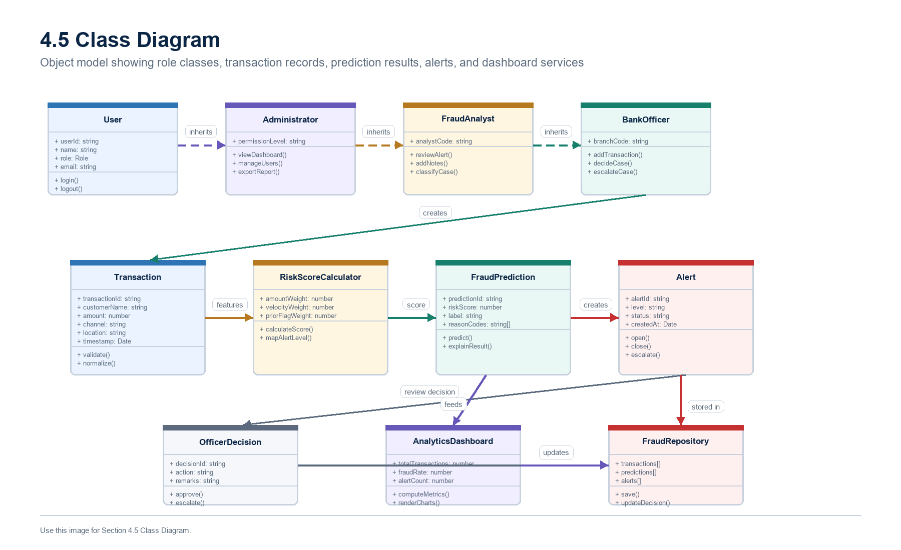
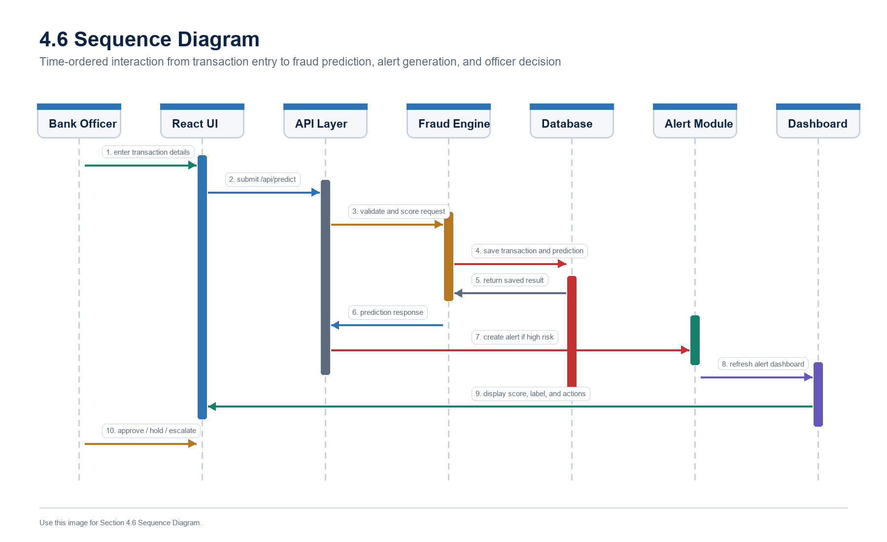
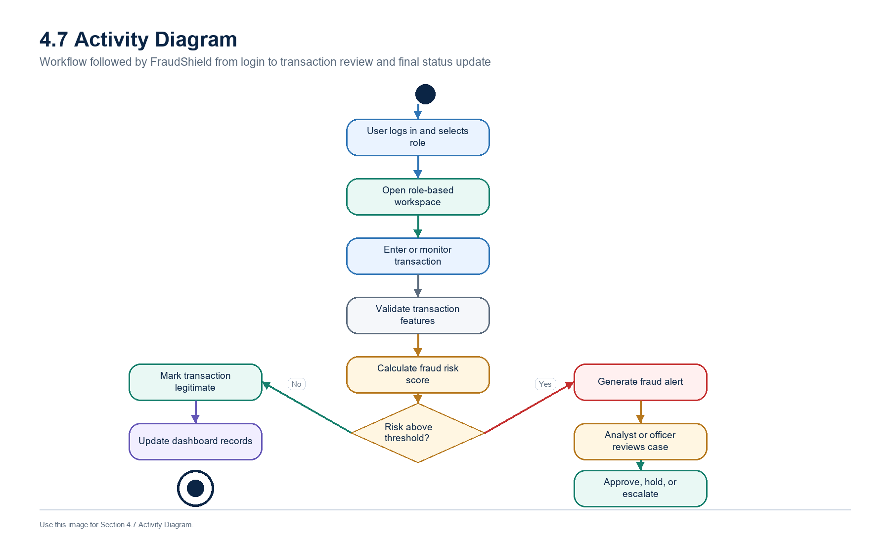
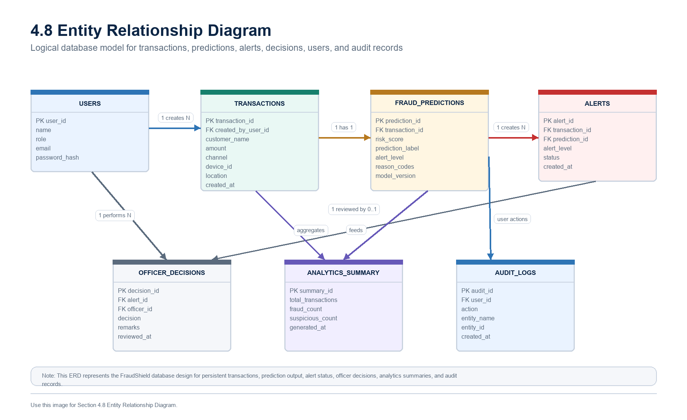

# MCA Project - FraudShield ML

FraudShield ML is an academic web application for the approved MCA project topic:

**Machine Learning-Based Financial Fraud Detection System for Digital Transactions**

The application demonstrates how digital transaction details can be monitored, scored,
classified, and reviewed through role-based screens. It includes transaction monitoring,
fraud risk score calculation, alert generation, case verification, and dashboard analytics.

## Project Overview

FraudShield is designed for financial fraud detection in digital payment environments.
The system accepts transaction details such as amount, channel, device trust, location
match, transaction velocity, previous fraud flags, and transaction time band. Based on
these input features, the system calculates a fraud risk score and classifies the
transaction as legitimate, suspicious, or fraudulent.

The application is organized around three main user roles:

- **Administrator**: views system-wide analytics, fraud trends, governance details,
  and operational summaries.
- **Fraud Analyst**: monitors suspicious transactions, runs prediction checks,
  reviews high-risk alerts, and studies risk reasons.
- **Bank Officer**: adds new transactions, verifies flagged cases, and records
  approval, hold, or escalation decisions.

## Synopsis Alignment

This project is related to the approved synopsis because it covers the core modules
expected from a machine learning-based financial fraud detection system:

| Synopsis Area | FraudShield Implementation |
| --- | --- |
| Digital transaction monitoring | Transaction tables, search, channel summaries, and risk views |
| Fraud prediction engine | Rule-based scoring implementation with ML-style classification flow |
| Risk score calculation | Weighted risk score based on amount, velocity, device, location, flags, and time |
| Alert generation | Monitor, Review, and Critical alert levels |
| Role-based review | Separate Administrator, Fraud Analyst, and Bank Officer workspaces |
| Analytics dashboard | Fraud rate, high-risk cases, risk distribution, and channel-wise summaries |
| Report support | System design diagrams and backend/database reference files |

## Key Features

- Secure-looking login screen with role selection.
- Dedicated routes for Administrator, Fraud Analyst, and Bank Officer.
- Fixed sidebar navigation with scrollable page content.
- Dashboard cards for total transactions, suspicious transactions, fraud rate,
  high-risk alerts, and model accuracy.
- Transaction monitoring table with risk labels and alert levels.
- Fraud prediction form for evaluating a new transaction.
- Risk score calculation with clear reason codes.
- Alert queue for high-risk transactions.
- Officer verification workflow with approve, hold, and escalate actions.
- New transaction entry screen under the Bank Officer module.
- Browser persistence using local storage for added transactions and officer
  decisions, so data remains after page refresh.
- Report-ready diagrams under the `reports/diagrams` folder.
- Optional FastAPI backend reference and SQL schema for explaining backend and
  database design in documentation.

## Technology Stack

| Layer | Technology |
| --- | --- |
| Frontend | React, Next.js App Router |
| Language | TypeScript |
| Styling | CSS with responsive layout |
| Data | JSON sample transactions and browser local storage |
| Backend Reference | Python FastAPI |
| Database Reference | SQL schema for users, transactions, predictions, and decisions |
| Package Manager | npm |

## Application Routes

| Route | Purpose |
| --- | --- |
| `/login` | Login and role selection screen |
| `/admin` | Administrator system overview |
| `/admin/analytics` | Fraud analytics and channel-wise trends |
| `/admin/governance` | Governance, controls, and model monitoring view |
| `/analyst` | Fraud Analyst transaction monitoring |
| `/analyst/prediction` | Fraud prediction engine and risk scoring form |
| `/analyst/alerts` | Alert queue and high-risk case review |
| `/officer` | Bank Officer case verification queue |
| `/officer/customers` | Customer risk review view |
| `/officer/actions` | Officer action center |
| `/officer/new-transaction` | New transaction entry form |

## Demo Login

Use the following sample credentials on the login screen:

```text
User ID: admin
Password: admin123
```

After entering the credentials, select one of the available roles:

- Administrator
- Fraud Analyst
- Bank Officer

The selected role decides which workspace and navigation menu will be opened.

## How Fraud Detection Works

FraudShield uses a scoring model that simulates the behavior of a fraud detection
engine. Each transaction starts with a base score and receives additional risk points
based on transaction behavior.

### Transaction Features Used

| Feature | Meaning |
| --- | --- |
| `amount` | Transaction amount in INR |
| `channel` | UPI, Mobile Banking, Credit Card, or Internet Banking |
| `deviceTrust` | Whether the device is trusted or new |
| `locationMatch` | Whether transaction location matches expected customer behavior |
| `velocityLastHour` | Number of transactions made in the last hour |
| `priorFlags` | Previous fraud or review flags for the customer |
| `timeBand` | Whether the transaction happened during day or night |

### Risk Scoring Logic

| Condition | Score Impact |
| --- | --- |
| Base score | `+8` |
| Amount greater than or equal to 80000 | `+30` |
| Amount greater than or equal to 40000 | `+18` |
| 5 or more transactions in last hour | `+18` |
| 3 or more transactions in last hour | `+10` |
| UPI channel | `+12` |
| Mobile Banking channel | `+15` |
| Credit Card channel | `+10` |
| Internet Banking channel | `+14` |
| New device | `+16` |
| Location mismatch | `+14` |
| Two or more previous flags | `+14` |
| One previous flag | `+7` |
| Night-time transaction | `+8` |

The final score is capped at `99`.

### Prediction Output

| Risk Score | Risk Level | Prediction | Alert Level |
| --- | --- | --- | --- |
| Below 45 | Low | Legitimate | Monitor |
| 45 to 69 | Medium | Suspicious | Review |
| 70 and above | High | Fraudulent | Critical |

## Role-Based Modules

### Administrator Module

The Administrator module provides a management-level view of the application.
It focuses on the overall health of the fraud detection process.

Main functions:

- View total transaction count.
- View suspicious transaction count.
- Monitor high-risk alerts.
- Check fraud rate and model accuracy.
- Understand risk distribution across low, medium, and high categories.
- Review governance and system monitoring information.

### Fraud Analyst Module

The Fraud Analyst module focuses on fraud investigation and prediction analysis.
It allows the analyst to study suspicious transactions and understand why a
transaction is risky.

Main functions:

- Monitor transaction records.
- Search and inspect suspicious transactions.
- Run the fraud prediction engine.
- View generated risk score, risk level, prediction, and alert level.
- Review high-risk alert queue.
- Understand reason codes such as high amount, new device, location mismatch,
  prior flags, and risky transaction time.

### Bank Officer Module

The Bank Officer module supports transaction verification and decision recording.
It is also the role responsible for adding new transaction entries in this
application.

Main functions:

- View verification queue.
- Add a new transaction through the New Transaction Entry screen.
- Review suspicious and high-risk cases.
- Mark a transaction as approved, held, or escalated.
- Review customer-level risk information.
- Keep entered transactions after refresh using browser local storage.

## Data Handling

The application starts with sample transaction records stored in:

```text
data/transactions.json
```

When a Bank Officer adds a new transaction, the data is stored in browser local
storage. This allows the transaction to remain available even after refreshing
the page in the same browser.

The main local storage areas used by the application are:

```text
fraud-demo-custom-transactions
fraud-demo-case-decisions
fraud-demo-role
```

## Backend Reference

The main application runs as a Next.js frontend application. A backend reference
is also included in the `backend` folder to show how the fraud prediction engine
can be represented as an API service.

Backend reference files:

| File | Purpose |
| --- | --- |
| `backend/main.py` | FastAPI application with health and prediction endpoints |
| `backend/fraud_model.py` | Python fraud scoring and classification logic |
| `backend/schema.sql` | SQL schema for users, transactions, predictions, and officer decisions |
| `backend/requirements.txt` | Python dependencies |
| `backend/README.md` | Backend run instructions |

Available reference endpoints:

```text
GET  /api/health
POST /api/predict
```

To run the backend reference separately:

```bash
cd backend
pip install -r requirements.txt
uvicorn main:app --reload
```

## Database Design Reference

The SQL schema describes the main tables required for a persistent fraud detection
system:

- `users`
- `transactions`
- `predictions`
- `officer_decisions`

The schema is included for project explanation, documentation, and future backend
integration.

## Project Diagrams

The repository includes report-ready diagrams inside:

```text
reports/diagrams
```

### System Architecture



### Data Flow Architecture



### Data Flow Diagram



### Use Case Diagram



### Class Diagram



### Sequence Diagram



### Activity Diagram



### Entity Relationship Diagram



## Folder Structure

```text
FraudDetectionDemo/
  app/
    [role]/[[...section]]/page.tsx
    login/page.tsx
    page.tsx
    layout.tsx
    globals.css
  components/
    fraud-dashboard.tsx
    login-screen.tsx
  data/
    transactions.json
  lib/
    fraud.ts
    role-routes.ts
  types/
    fraud.ts
  backend/
    main.py
    fraud_model.py
    schema.sql
    requirements.txt
    README.md
  reports/
    diagrams/
      fraudshield_system_architecture.png
      fraudshield_data_flow_architecture.png
      fraudshield_data_flow_diagram.png
      fraudshield_use_case_diagram.png
      fraudshield_class_diagram.png
      fraudshield_sequence_diagram.png
      fraudshield_activity_diagram.png
      fraudshield_entity_relationship_diagram.png
  package.json
  package-lock.json
  tsconfig.json
  next.config.ts
  README.md
```

## Installation and Local Setup

### 1. Clone the Repository

```bash
git clone https://github.com/NikhilSriSu/MCA-project.git
cd MCA-project
```

### 2. Install Dependencies

```bash
npm install
```

### 3. Start Development Server

```bash
npm run dev
```

Open the application in the browser:

```text
http://localhost:3000
```

The home page redirects to the login screen.

### 4. Build for Production Check

```bash
npm run build
```

### 5. Start Production Build Locally

```bash
npm run start
```

## Main Source Code References

| File | Description |
| --- | --- |
| `components/login-screen.tsx` | Login screen and role selection UI |
| `components/fraud-dashboard.tsx` | Main dashboard, role-based screens, forms, tables, and local persistence |
| `lib/fraud.ts` | Risk score calculation, prediction classification, alert mapping, and dashboard metrics |
| `lib/role-routes.ts` | Role route configuration for Administrator, Fraud Analyst, and Bank Officer |
| `types/fraud.ts` | TypeScript interfaces and project data types |
| `data/transactions.json` | Sample digital transaction dataset |
| `backend/main.py` | FastAPI prediction endpoint reference |
| `backend/schema.sql` | Database schema reference |

## Example Transaction Record

```json
{
  "id": "TXN-2026-1002",
  "customer": "Priya Verma",
  "amount": 98000,
  "channel": "Internet Banking",
  "deviceTrust": "new",
  "locationMatch": "mismatch",
  "velocityLastHour": 6,
  "priorFlags": 2,
  "timeBand": "night"
}
```

For this type of transaction, the system increases the risk score because the
amount is high, the device is new, the location does not match, transaction
velocity is high, previous flags exist, and the transaction happened at night.

## Academic Use

This repository is prepared for MCA project demonstration and report explanation.
It is useful for:

- Showing project source code.
- Capturing UI screenshots.
- Explaining role-based modules.
- Demonstrating fraud prediction workflow.
- Explaining system design diagrams.
- Presenting frontend, backend, and database references during review.

## Future Enhancements

The project can be extended further with:

- Real user authentication.
- Database connection using PostgreSQL or SQLite.
- Live FastAPI integration with the Next.js frontend.
- Trained machine learning model using real transaction datasets.
- Admin user management.
- Audit logs and exportable reports.
- Cloud deployment on AWS, Azure, or Vercel.
- Docker-based deployment setup.

## Project Summary

FraudShield ML demonstrates the working flow of a financial fraud detection
system for digital transactions. It combines a role-based web interface,
transaction monitoring, risk score calculation, fraud prediction output, alert
generation, officer decision handling, and analytics dashboards in one local
project.
